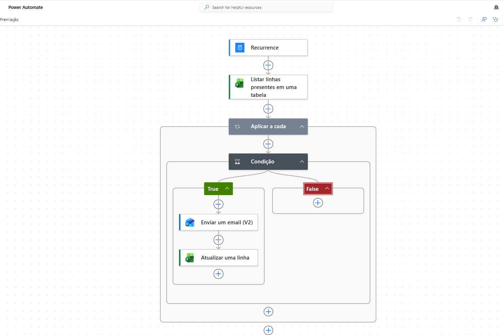
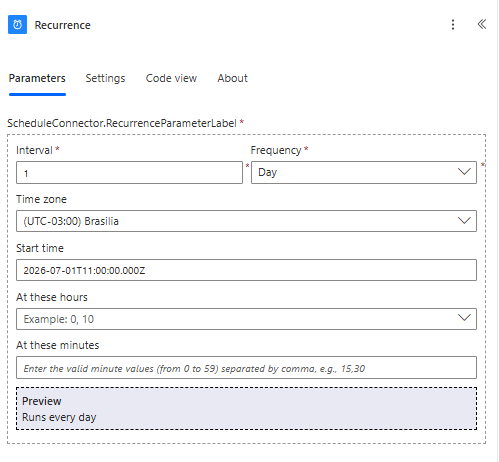
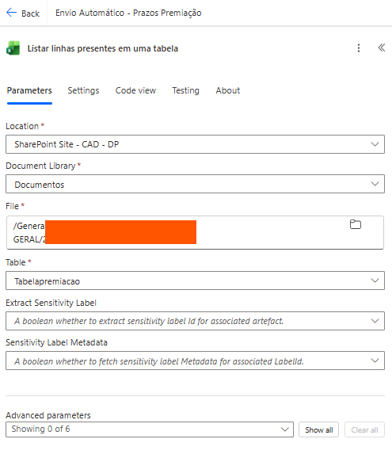
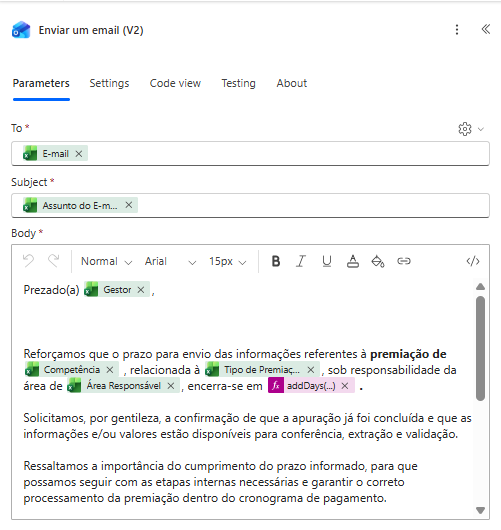
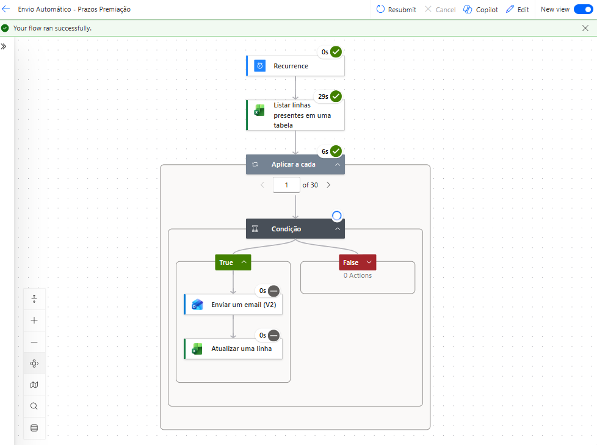
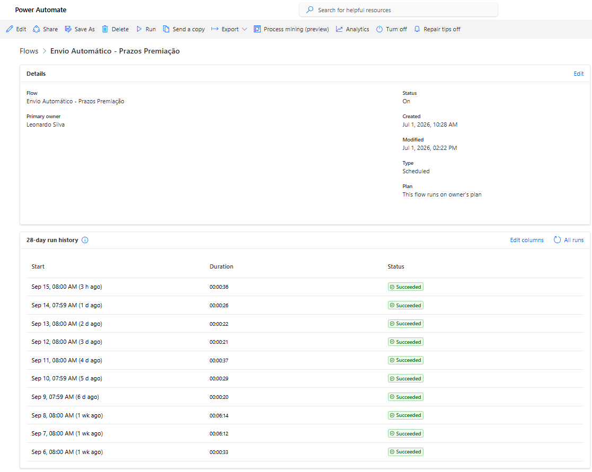
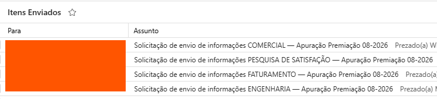

# Automação de Prazos de Premiação

### Power Automate · Automação de Processos · Remuneração & Benefícios

Case de automação desenvolvido para apoiar o controle de prazos do processo de premiação, automatizando verificações, comunicações e atualizações da base operacional.

A solução conecta ferramentas do ecossistema Microsoft 365 para transformar uma rotina recorrente em um fluxo automatizado orientado por regras de negócio.

<br>



<br>

## Visão geral

O processo de premiação envolve diferentes áreas, responsáveis e prazos para envio de informações.

O acompanhamento dessas datas exige comunicação recorrente e controle sobre quais responsáveis ainda possuem ações pendentes.

A solução foi criada para automatizar parte desse processo, permitindo que o fluxo:

- execute de forma recorrente
- consulte a base operacional
- avalie as regras de negócio
- identifique registros que exigem comunicação
- envie e-mails automaticamente
- atualize a própria base após o processamento
- mantenha histórico das execuções

---

## O desafio

O acompanhamento manual de prazos exige atenção constante para identificar quais áreas precisam ser acionadas.

Além do envio das comunicações, também é necessário manter o controle atualizado para evitar mensagens duplicadas ou perda de rastreabilidade.

O desafio era transformar essa rotina em um processo capaz de funcionar de forma recorrente, mantendo a lógica de negócio já utilizada pela área.

---

## A solução

O fluxo foi desenvolvido no **Power Automate** e integrado ao ecossistema Microsoft 365.

A arquitetura utilizada foi:

```text
Recorrência programada
        ↓
Leitura da base operacional
        ↓
Aplicação em cada registro
        ↓
Validação da regra de negócio
        ↓
Condição
     ↙     ↘
   True    False
    ↓
Envio de e-mail
    ↓
Atualização da linha
    ↓
Registro da execução
```

Essa estrutura permite que cada registro seja analisado individualmente antes da execução de qualquer ação.

---

## Recorrência programada

O fluxo foi configurado para executar automaticamente em uma frequência definida.



A recorrência elimina a necessidade de iniciar manualmente o processo a cada ciclo.

---

## Leitura da base operacional

A automação consulta uma tabela estruturada utilizada como base para o acompanhamento dos prazos.



Cada linha representa uma informação que será analisada pelas regras configuradas no fluxo.

---

## Regra de negócio

Após a leitura dos registros, o Power Automate percorre a base e aplica uma condição para determinar quais ações devem ser executadas.


Quando a condição é atendida, o fluxo segue para a comunicação e atualização da base.

Quando não é atendida, nenhuma ação é executada naquele registro.

---

## Comunicação automatizada

Os e-mails são construídos dinamicamente utilizando informações provenientes da própria base.



Entre os elementos personalizados estão informações como:

- responsável
- competência
- tipo de premiação
- área responsável
- prazo aplicável ao processo

Isso permite que a comunicação seja direcionada de acordo com o contexto de cada registro.

---

## Execução do fluxo

O Power Automate permite acompanhar cada etapa executada e validar o comportamento das regras configuradas.



Essa visualização facilita a validação da automação e a identificação de eventuais falhas.

---

## Operação recorrente

O histórico de execuções permite acompanhar a continuidade do fluxo ao longo do tempo.



O registro das execuções também funciona como uma camada de rastreabilidade para o processo automatizado.

---

## Resultado da automação

As comunicações geradas pelo fluxo são enviadas automaticamente conforme as condições identificadas na base.



A própria base é atualizada após o processamento, permitindo registrar o tratamento realizado e apoiar os próximos ciclos da automação.

---

## Meu papel no projeto

Atuei na concepção e desenvolvimento da solução:

- entendimento do processo de premiação
- identificação da rotina passível de automação
- definição das regras de negócio
- estruturação da base operacional
- construção do fluxo no Power Automate
- configuração da recorrência
- construção das condições
- desenvolvimento da comunicação dinâmica
- integração com Outlook
- atualização automática da base
- testes e acompanhamento das execuções

O projeto conecta conhecimentos de **Remuneração & Benefícios, processos, automação e Microsoft 365**.

---

## Stack

`Power Automate` · `Excel` · `SharePoint` · `Outlook`

`Microsoft 365` · `Automação de Processos` · `Remuneração & Benefícios`

---

## Resultado

O processo passou a contar com uma camada automatizada para acompanhamento e comunicação de prazos.

> **De uma rotina recorrente de acompanhamento para um fluxo automatizado orientado por regras de negócio.**

Além da automação das comunicações, a solução mantém atualização da base e histórico das execuções, aumentando a rastreabilidade do processo.

---

## Privacidade e confidencialidade

Este repositório possui finalidade exclusivamente profissional e demonstrativa.

As evidências foram selecionadas para demonstrar a arquitetura e o funcionamento da automação sem disponibilizar bases de dados, credenciais ou informações corporativas originais.

Dados pessoais e informações internas foram omitidos ou anonimizados quando necessário.

---

## Portfólio

Este projeto faz parte do meu portfólio profissional, que reúne cases de **Remuneração & Benefícios, People Analytics, dados, automação e RH Tech**.

### [Acessar portfólio profissional](https://lroseno.github.io/)

---

## Contato

**Leonardo Roseno**

[LinkedIn](https://linkedin.com/in/leonardoroseno) · [Portfólio](https://lroseno.github.io/)
